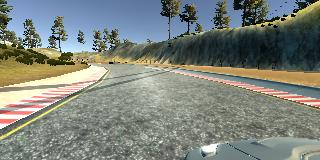
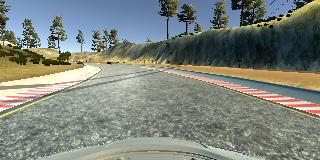
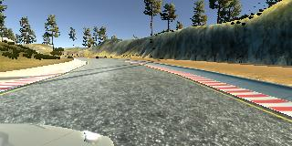
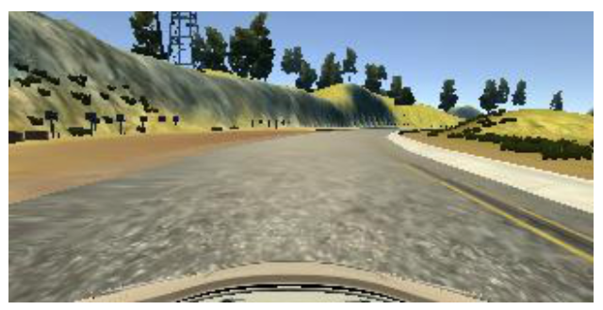
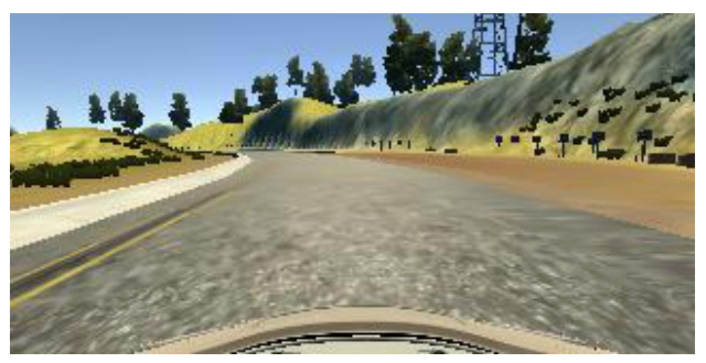
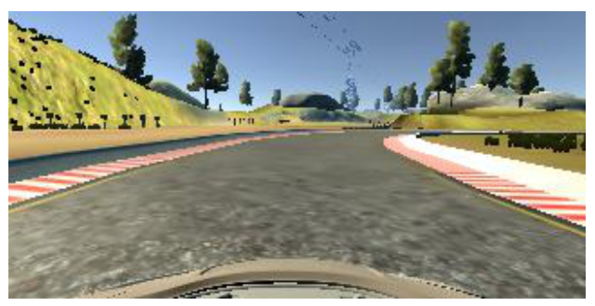
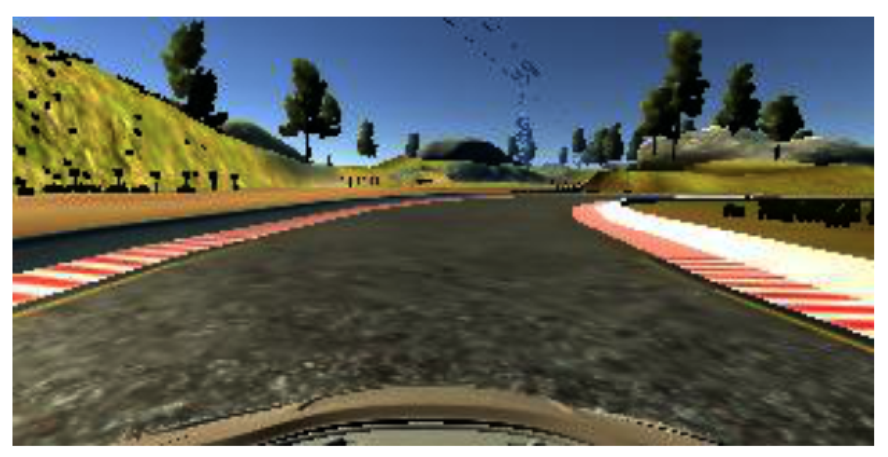
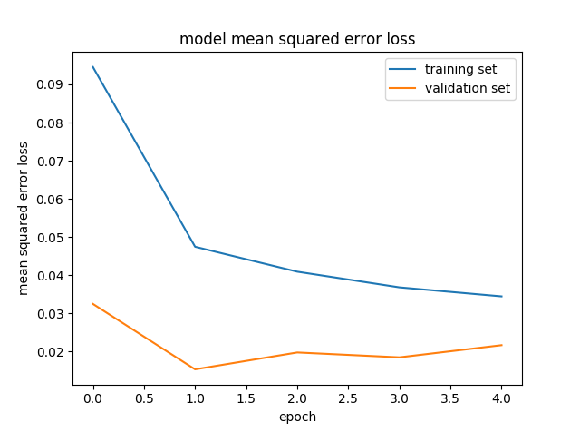

# 1. Introduction
The purpose of this project is to build and learn a deep neural network that can mimic the behavior of humans driving a car. Obtained data by running Udaicty Autonomous Simulator, designed Neural Network architecture to training by the obtained data and drive autonomously with Udacity Autonomous Simulator. 

# 2. Data Collection and Simulation Environment
## Lab Environment 
* Setup with predefined [Udacity](https://github.com/udacity/CarND-Term1-Starter-Kit) environment  
* Python 3.5.2 with required library was included, Tesnforflow, Keras
## Udacity Autonomous Simulator
* [Linux Simulator](https://s3.amazonaws.com/video.udacity-data.com/topher/2016/November/5831f0f7_simulator-linux/simulator-linux.zip)
* [Windows 64 Bit Simulator](https://s3.amazonaws.com/video.udacity-data.com/topher/2016/November/5831f3a4_simulator-windows-64/simulator-windows-64.zip)
* [Windows 32 Bit Simulator](https://s3.amazonaws.com/video.udacity-data.com/topher/2016/November/5831f4b6_simulator-windows-32/simulator-windows-32.zip)

# 3. Data Collection
## Collect the data using simulator
* Run the Udacity Autonomous Simulator for proper OS version
* After choseing monitor resolution, select play
* Select Training Mode from Simulator
* Select Record and When file explore pop up, browse output folder to save the file.
* Click Record and Collect the data while driving around track. 

## the data collection method
* Recommand using joystic 
* When circle around track, try to keep on center.
* For the extra data collection, circle around track twice
* For the different data collection, drive around counter clockwise 

# 4. Network Architecture
## Preprocess
  * Normalize the data included the lambda layer with model 
    ```python
    Lambda(lambda x: x / 255.0 - 0.5, input_shape=(160,320,3))
    ```
  * Cropping unnecessary image from data with model
    ```python  
    Cropping2D(cropping=((70,25),(0,0)))
    ```
  
## Network Architecture with NVIDIA  
I chosed the basic [NVIDIA's End to End Learning for Self-Driving Cars](https://arxiv.org/pdf/1604.07316v1.pdf) as my base model

| Layer (type)                    | Output Shape        | Param # |
|---------------------------------|---------------------|---------|
| lambda_1 (Lambda)               | (None, 160, 320, 3) |  0      |
| cropping2d_1 (Cropping2D)       | (None, 65, 320, 3)  |  0      |
| convolution2d_1 (Convolution2D) | (None, 31, 158, 24) |  1824   |     
| convolution2d_2 (Convolution2D) | (None, 14, 77, 36)  |  21636  |     
| convolution2d_3 (Convolution2D) | (None, 5, 37, 48)   |  43248  |     
| convolution2d_4 (Convolution2D) | (None, 3, 35, 64)   |  27712  |     
| convolution2d_5 (Convolution2D) | (None, 1, 33, 64)   |  36928  |     
| flatten_1 (Flatten)             | (None, 2112)        |  0      |     
| dense_1 (Dense)                 | (None, 100)         |  211300 |     
| dense_2 (Dense)                 | (None, 50)          |  5050   |     
| dense_3 (Dense)                 | (None, 10)          |  510    |     
| dense_4 (Dense)                 | (None, 1)           |  11     |     


# 5. Training
## Data Description
I collected three different decent set of data; however, I wasn't able to obtain acceptable result driving under autonomous mood. While I was obtain the data, using keyboard, it was difficult to stay in center of road. So I used the data which was share by Udacity. Using the share data from udacity, I was successfully train model, and I was able to obtain exceptional result with autonomous mood. 

348,219 Params was used to train.  

### For obtaining the data, three camera angle was used
During the data collection, three carmera was used to collect the data which is center camera, left camera and right camera was used. To get the accurecy of training, I descided to use all three camera to train the model. 

## Data Augmentation
Augmentation refers to the process of generating new training data from a smaller data set. This helps us extract as much information from data as possible.
Since I wanted to proceed with only the given data set if possible, I used some data augmentation techniques to generate new learning data.

Left | Center | Right
-----|--------|------
 |  | 

### Random flip
Each image was randomly horizontally flipped and negate the steering angle with equal probability. This will help to choose the center of image. Random flip specially help to chose the center of the road. 

Before | After
-------|-------
 | 

### Random shadow
Chaging brightness to simulate differnt lighting conditions. Random gamma correction is used as an alternative method changing the brightness of training images.

Before | After
-------|-------
 | 

### Random translate
The roads on the second track have hills and downhill, and the car often jumps while driving. To simulate such a road situation, I shifted the image vertically randomly. This work was applied after image preprocessing.

## Data Generators
In this training, I used a generator, which randomly samples the set of images from csv file. As mentioned earlier, because there is a lot of data with a steering angle of 0, I removed this bias by randomly extracting the data. These extracted images are transformed using the augmentation techniques discussed above and then fed to the model.

I also used a generator for validation. This generator receives data for validation and returns the corresponding center camera image and steering angle. 

## Training parameters
* Adam optimizer with a learning rate of 0.001
* 128 batch size
* 5 training epochs

## result
```python
Epoch 1/5
6528/6400 [==============================] - 144s - loss: 0.0946 - val_loss: 0.0325
Epoch 2/5
6528/6400 [==============================] - 135s - loss: 0.0475 - val_loss: 0.0153
Epoch 3/5
6612/6400 [==============================] - 136s - loss: 0.0409 - val_loss: 0.0198
Epoch 4/5
6528/6400 [==============================] - 137s - loss: 0.0368 - val_loss: 0.0185
Epoch 5/5
6528/6400 [==============================] - 134s - loss: 0.0345 - val_loss: 0.0217
```

  
# 6. Drive Autonomously
## Drive with record
Run drive.py using the saved model and the result will be save to run1 folder
```python
python drive.py model.h5 run1
```
## Generated Video as mp4 file
Run video.py will generate mp4 file with fps 48
```python
python video.py run1 --fps 48
```

# 7. Conclusions
This lab was very closed to real life Autonomous Vehicle development. Using simulator, I had to collect the data. Once I designed the model, I used the collected data to training. Once I successfuly trained the data, I was able to drive autonomouly. 